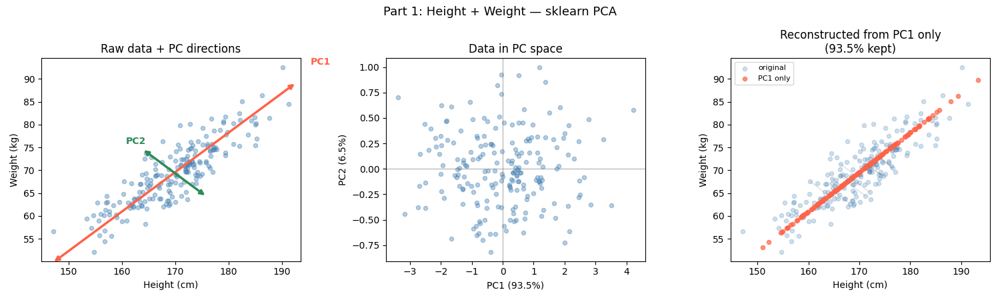
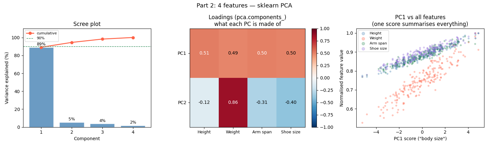

# PCA Implementation

## Results and Notes: 2-feature dataset

Highly correalted features (weight and height)  
- Plot 1 (left): shows raw data, PC1 and PC2  
- Plot 2 (middle): data viewed from a differnet angle  
- Plot 3 (right): first the data was compressed into a single feature plane (body_size), then decompressed into the 2D plane again. The red dots represent the final data after this process (laying on PC1 line), blue dots show the original data points, and the gray line shows the loss from those original points.  
 
NOTE: PC1 is basically the line of best-fit

## Results and Notes: Multi-feature dataset

- Plot 1 (Scree plot): shows how variance is distributed among all features. A steep drop means the features are highly correlated and one component summerizes most of the data. A flat distribution would mean features are independent and PCA isn't helping much. Here, since PC1 is already almost at the 90% threshold, that would be enough.  
- Plot 2 (middle): shows that PC1 treats all features almost equally. But PC2 is emphisizing on the weight more than the rest of the features.  
- Plot 3 (right): PC1 vs. actual measurements -> the fact that all four feature clouds line up along the same diagonal shows that oen features is enough to represent them.